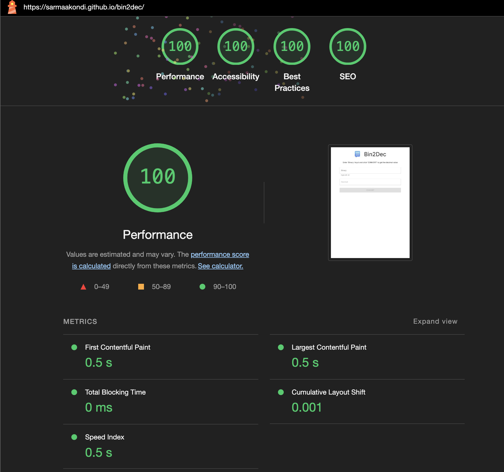

# Bin2Dec

Bin2Dec allows the user to enter strings of up to 32 binary digits, 0's and 1's, in any sequence and then displays its decimal equivalent.

## How to use

Download the example [or clone the repo](https://github.com/sarmaakondi/bin2dec.git):

```bash
git clone https://github.com/sarmaakondi/bin2dec.git
cd bin2dec
```

Install it and run:

```bash
npm install
npm run dev
```

## Live App

<a href="https://sarmaakondi.github.io/bin2dec/" target="_blank">Bin2Dec</a>

## Lighthouse Scores for Desktop and Mobile

-   **Performance**: 100/100
-   **Accessibility**: 100/100
-   **Best Practices**: 100/100
-   **SEO**: 100/100

### Lighthouse Report - Desktop



### Lighthouse Report - Mobile


